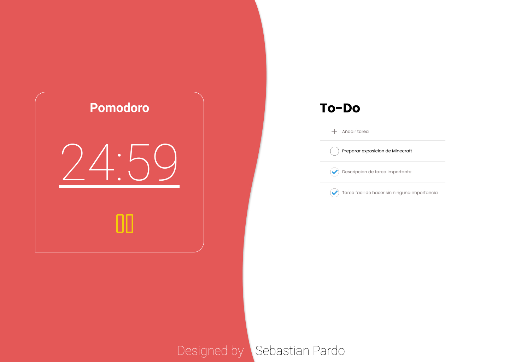

# Tododoro

Aplicación Web que junta las funcionalidades de una lista TO-DO con un temporizador pomodoro con sesiones de trabajo y descanso.

## Motivación

Pomodoro es una conocida y popular técnica para administrar el tiempo de trabajo en cada actividad, esta consiste en periodos de 25 min. de trabajo seguido de 5 min. de descanso.
Ya que la técnica pomodoro se encofoca en el trabajo en actividades especificas durante cada periodo de trabajo, se hace comodo el tener la lista de tareas a hacer (to-do) junto al temporidazor pomodoro. Teniendo al alcance de la misma aplicacion las tareas pendientes y el temporizador ajustable al tiempo necesario estimado para cada tarea.

## Screenshots

Pagina inicial y unica.

## Features

Puedes encontrar un documento detallando el alcance del proyecto en [ALCANCE.md](./ALCANCE.md)

- Lista de tareas TO-DO
- Temporizador con funcionalidades pomodoro.
- Notificación al termino de cada periodo.

## Metodo de trabajo

1. Definir todas las tareas a realizar en un periodo de tiempo autodeterminado (no un periodo de pomodoro, sino el periodo de trabajo total).
2. Seleccionar la tarea a realizar haciendo click en el titulo.
3. Empezar temporizador pomodoro haciendo click en el icono de **start**
    - En caso de terminar la tarea seleccionada antes de que finalice el temporizador, seleccionar otra segun el paso 2 y seguir trabajando.
4. Descansar en cuanto el temporizador de sesion de trabajo termine.

## Tecnologias

- React 17.0.1
- Figma (desarrollo de UI)

## Licencia

Los contenidos de este repositorio se encuentran publicados bajo la licencia [GNU GPL-3.0](./LICENSE)
